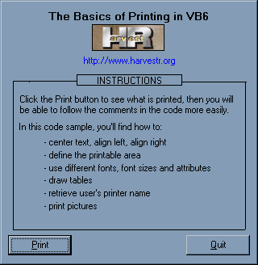



## All the Basics of Printing in VB

### Description

This code, completely documented, will show you how to easily print text and pictures in VB, with no API calls and no external OCX. Please see the snapshot for all topics covered in it.
 
### More Info
 
feel free to edit, modify, comment, upgrade or offer better solutions

nice printed pages :-)

low ink cartridge level...

             |
---                |---
**Submitted On**   |2000-07-24 03:41:28
**By**             |[HarvestR](https://github.com/Planet-Source-Code/PSCIndex/blob/master/ByAuthor/harvestr.md)
**Level**          |Beginner
**User Rating**    |4.7 (206 globes from 44 users)
**Compatibility**  |VB 6\.0
**Category**       |[Coding Standards](https://github.com/Planet-Source-Code/PSCIndex/blob/master/ByCategory/coding-standards__1-43.md)
**World**          |[Visual Basic](https://github.com/Planet-Source-Code/PSCIndex/blob/master/ByWorld/visual-basic.md)
**Archive File**   |[CODE\_UPLOAD80647232000\.zip](https://github.com/Planet-Source-Code/harvestr-all-the-basics-of-printing-in-vb__1-9992/archive/master.zip)

